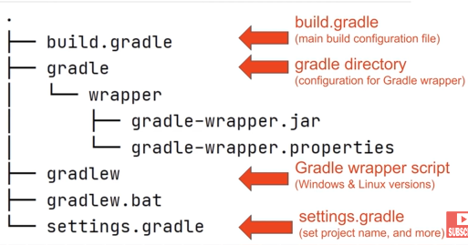
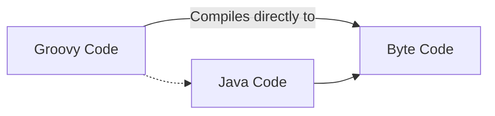
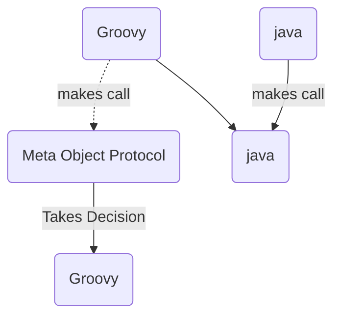
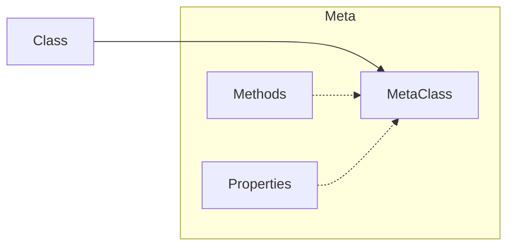

### Gradle + Groovy

# Gradle

### Introduction

- Build Automation Tool
- Managers dependencies and all stuff that mvn does but it's better than mvn
- Uses Groovy.
- Is fast and comes with many idempotent features.

.gitignore : .gradle

### Project Structure and Initialize a new Project



- `gradle init` to create a new project with a gradle wizard

> Remember: Always use gradle wrapper to run your tasks

- `./gradlew help` : manning

- `./gradlew dependencies` : To see all the dependencies

### Gradle and Java

Java Project Requirements

- .java -> .class files
- manage resources that live alongside code
- package everything into a jar file
- easily run tests
- define dependenices

All the above requirements can be satisfied by just adding a Java Plugin as shown below:

```groovy
plugins {
    // core gradle plugin
    id 'java'
}
jar {
    manifest {
        // creates a manifest file and tells what is the main class
        attributes('Main-Class' : 'com.tomgregory.languageapp.SayHello')
    }
}
```

- adds a task:compileJava `./gradlew compileJava`
- managing resources using task:processResources `./gradlew processResources`
- package into JAR file task:jar `./gradlew jar` found in directory _build > libs_
- task:test `./gradlew test`
- define dependencies in `build.gradle`

  ```groovy
  // Specifying the respository from where to download the dependenices
  repositories {
    mavenCentral()
  }

  dependencies {
    implementation  'org.apache.commons:commons-lang3:3.11'
    testImplementation 'org.junit.jupiter:junit-jupiter-api:5.6.0'
  }
  ```

# **Groovy**

- Built on top of Java to make the development process faster and easier with less boilerplate code
- Purely Object Oriented



- `groovyc` : compiles the groovy code to byte code

### **imports**

- you get the default imports by default they won't be visible
- importing a class :

  ```groovy
  import groovy.xml.MarkupBuilder
  import groovy.xml.*
  ```

### **Comments**

- Single-line comment `// This is a comment`

- Multi-line comment

  ```groovy
  /*
    Multi-line comment
  */
  ```

- groovy-doc comment :

  ```groovy
  /**
  * @Params:
  * @Return:
  * groovy-doc comment, used for generating documentation
  */
  ```

- shebang comment :

  ```groovy
  #!/usr/bin/env groovy
  println "Hello, World!"
  ```

### **Assertions**

- can be simply used with `assert` keyword
- examples :
  - `assert true`
  - `assert 1 == 1`
  - `assert 1 == (3+10)\100 * 5\20`

### **Scripts**

- groovy can be called as scripting langauge with the definiton outside the class body, but this is actually not true.
- when compiled the definiton is placed into a method run in class created by groovy

### **Classes**

- similar to Java Classess but on steroids

- same class name is not required as the file name

- you can define multiple classess in one file and at compile time you will have n separate \*.class files

- ### Creating a class

  ```groovy
  // By default all classes & methods are public, but you can use access modifiers to change the scope
  class User {
    String first
    String last

    def languages = []

    public void printName() {
        println "$first $last"
    }
  }

  ```

- ### Using a class

  ```groovy
  User u = new User()

  // Setting a property or data member
  d.first = "Dan"
  d.setFirst("Dan")

  d.printName()

  // adding objects to ArrayList
  d.languages << "Groovy"
  d.languages << "Java"

  ```

### **Numbers**

- Groovy uses only Objects wrapper for numbers, even if you wish you can't use the primitive data types here.

  - example :

    ```groovy
    int x = 10
    println x.class // op: class java.lang.Integer

    def y = 10.5d
    println y.class // op: class java.lang.Double

    def y = 10.5
    println y.class // op: class java.math.BigDecimal
    ```

- Groovy can identify on it's own what type of number is being used.

### **Loops**

- **for** x **in** y

  ```groovy
  def list = [1,2,3,4,5]
  for ( num in list ) {
      println num
  }
  ```

- **switch**

  ```groovy
  switch(x){
    case 1:
        // do something
        break
    case 2:
        // do something different
        break
    default:
        // do default
        break
  }

  ```

## **Annotations and AST Transformations**

```groovy

@Controller // Annotation
class x {

}

```

Documentation: [AST transformations](https://docs.groovy-lang.org/latest/html/gapi/groovy/transform/package-summary.html)

AST transformations helps us to perform bunch of funtionalites using just annotations.

Use annotations like immutable, Synchronization and more to quickly add some functionality to your classes.

example: `@toString`

Found in: `groovy.transform` package

```groovy
// Once set using the constructor args it can't be updated (set)
@Immutable
class Customer {
    String first, last
    int age
    Date since
    Collection favItems
}
```

---

### **operators**

- ### Ternary Operators

  ```groovy
  x = condition ? true : false
  ```

- ### Elvis Operators

  ```groovy
  // if condition use condition else default
  x = condition ? : "default"
  ```

- ### Object Operators

  ```groovy
    // if p.address == null this won't throw error.
    def address = p?.address
  ```

## Grape

- Jar dependency manager embeded into groovy
- Used with the help of annotations

  ```groovy
  @Grapes{
    // downloads this dependency from mvn
    @Grab(group='org.apache.commons', module='commons-lang3' , version='3.4')
  }
  ```

## **Data Types**

- Everything is a object in groovy
- `def` We don't care what datatype

```groovy
def x = 10
x = "Dan" // Yes, This will work!!!
// No assignment error

```

### **Converting Datatypes**

```groovy
// type casting
def myFloat = (float)1.0

// converting to a different fam
int a = '5'.toInteger()
``'
```

### **Times | Upto | Downto | Step**

- times

  ```groovy
  // prints - 20 times
  20.times{
    print '-'
  }

  ```

- upto

  ```groovy
    // prints 1 to 10
    1.upto(10){ num ->
      print num
    }

  ```

- upto

  ```groovy
    // prints 10 to 1 (reverse)
    10.downto(1){ num ->
      print num
    }

  ```

- step

  ```groovy
  // prints 0 to 1 with step 0.1
  0.step(1,0.1){ num ->
    print num
  }
  ```

### **Strings**

- String str = 'this is a string'
- By default considers `char` a `String`

#### **String Interpolation**

```groovy
def name = "World"
String msg = "Hello ${name}" // evaluated at runtime o/p: Hello World
String msg = 'Hello ${name}' // evaluated the actual expression o/p: Hello ${name}

```

#### **Multi-line quotes**

```groovy
def multiline = '''
This will
be printed as it
is loo-
-king right
noww!
'''
```

### **Collections**

## Range

```groovy
Range r = 1..10
println r // [1,2,3.....,10]
println(r.from , r.to) // 1 , 2

// Exclude the last
Range exclusionRange = 1..<10

//Using range with dates
Date today = new Date()
Date oneWeekAway = today + 7

Range days = today..oneWeekAway

Range letters = 'a'..'z'

```

### Contains

```groovy
assert (0..10).contains(0)
```

## List

```groovy
def nums = [1,2,3,4]
println nums.class.name // java.Util.ArrayList

// Specifying what type of list it should be
List ll = [1,2,3,4] as LinkedList

// pushing
ll.push(99)
ll.putAt(0,77)
ll[0] = 77


// appending
List appendedLists = ll + 3
ll << 66 //left shift append

//removing an item
ll.pop()
ll.removeAt(0)
def newList = nums - 1 //removes 1


// getAt()
nums.getAt(0..3) // numbers from 0,1,2,3

// flatten
nums << [3,4,5]
nums << [1,2]
nums.flatten() // flattens the list of lists and make a big lists

// unique
nums.unique()  // Only unqiue items
def numbers = [1,2,3,44,43,2,121,4] as Set
def numbers = [1,2,3,44,5324,343,3] as SortedSet

```

## Maps

```groovy

LinkedHashMap map = [:]
def person = [firstName:"sda", lastName:"ada", email:"eqwe@gmali.moc"]

// accessing the values (get)
person.firstName

// setting the value (set)
person.firstName = "NewName"

def emailKey = "EmailAddress"
// key will be emailKey not it's value
def twitter = [username: "username", emailKey:"eqwe@gmali.moc"]
// If you want the key to be the value of emailKey use parenthesis
def twitter = [username: "username", (emailKey):"eqwe@gmali.moc"]

// Sorting
person.sort()

// looping
for (entry in person) {
  println entry
}
for ( key in person.keySet() ){
  println "$key:${person[key]}"
}
```

## Enums

```groovy

enum Days {
  SUNDAY, MONDAY, TUESDAY ...
}
```

Advanced Groovy

# **[Closures](https://groovy-lang.org/closures.html#:~:text=A%20closure%20in%20Groovy%20is,declared%20in%20its%20surrounding%20scope.)**

`groovy.lang.Closures`

anonymous block of code, takes parameters , performs actions and returns, can be assigned to a variable

- It is an object.
- Closures are used for :
  - Iterators
  - Callbacks
  - Higher-order functions
  - Specialized Control Structure
  - Builders
  - Resource Allocation
  - Threads
  - DSLs
  - Fluent Interfaces

## Creating a Closure

```groovy
def c = { }
assert c instancof Closure

def funcName = { param ->
  // do something

}

// You can really pass this sayHello method to anywhere as it is an objects
def sayHello = { name ->
  println "Hello"
}

// each
def nums = [1,2,3,4,5]
// default
nums.each({
  println it
})
// named param
nums.each({ num ->
  println num
})

// [IMP]
// Passing Closure as object & Last param
def timesTen(num, closure){ // accepts an int and a closure
  closure(num * 10)
}

// Passing the closure as object to a function call
timesTen(2, { println it })

// When the closure is the last param of a function/method
// This is the special way of passing a closure to it
timesTen(2) {
  println it
}

// More uses
10.times{
  println it
}
import java.util.Random
Random rand = new Random()
3.times{
  println rand.nextInt()
}
```

## **Closure Parameters**

```groovy

// implicit parameters
def foo = {
  println it
}

foo("dan")

// No Params
def noParams  = {
  println "no params"
}
noParams(1) // This will work
// We need to explicitly define using an empty arrow
def noParams  = { ->
  println "no params"
}
noParams(1) // Will not work
noParams() // Will work

// Passing multiple parameters
def multiParams = { first, last ->
  println "Hello, $first $last"
}

// Restricting the type of passed parameter
def resMultiParams = { String first, String last ->
  println "Hello, $first $last"

}

// Default params
def defaultParams = { String name, String greeting = "Hello" ->
  println "$greeting", "$name"

}

// Variable args
// Used when number of passed params are variable or not knows
def variableArgs = { String... args ->
  args.join(' ')
}
variableArgs('abc', 'def', 'cat') // output: 'abc def cat'

// Some Important Properties of Closures
def someMethod(Closure c){
  // calling these on Closure object
  println c.maximumNumberOfParameters
  println c.parameterTypes
}

```

## **Collections with Closures**

### **each**

```groovy

// each & eachWithIndex
List favNums = [12,323,3232323232, 232,23]
// Normally each
for(each in favNums){
  println each
}
// Using Closures each
favNums.each { println its}
// WithIndex
for(int i=0; i<favNums.size() ;i++){
  println "$i $favNums[i]"
}
// Using Closures with eachWithIndex
favNums.eachWithIndex { nums, index ->
  println "$nums $index"
}
```

### **findAll**

```groovy

List days = ["Sunday", "Monday" ....]
// Using findAll and passing a closure for filterings
List weekend = days.findAll{it.startsWith("S")}

```

### **Collect**

```groovy
List nums = [1,23,4,4,5,3]
List numsTimesTen = []
// Normal way , not efficient as we are iterating over the whole list
nums.each{ num ->
  numsTimeTen << num* 10
}

// using Collect
List newTimesTen = nums.collect{ num -> num*10}
```

### **Curry Methods**

makes a partial application, concept is it allows us to create a new closure based of an existing closure

```groovy

// A simple closure to print logs
def log = { String type Date createdOn, String msg ->
  println "$createdOn [$type] - $msg"
}

// Now if we want to call this multiple times we need to redundantly copy paste the whole statement
log("DEBUG", new Date(), "This is my first debug statement...")
log("DEBUG", new Date(), "This is my first debug statement 2...")
log("DEBUG", new Date(), "This is my first debug statement 3...")
log("DEBUG", new Date(), "This is my first debug statement 4...")

// Using curry to create a debug log closure from an existing log closure
def debugLog = log.curry("DEBUG") // returns the log closure with type parameter populated already
debugLog(new Date(), "This is a debug log")

// Create a today log with removing Date Parameter also
def todaysDebugLog = log.curry("DEBUG", new Date())
todaysDebugLog("This is today's DEBUG log statement")
```

#### rcurry (right curry)

pass parameters from right to left to a curry

```groovy
// Right Most Parameter set here
def crazyPersonLog = log.rcurry("Why Am I logging this way")
crazyPersonLog("ERROR", newDate())
```

#### ncurry (index based curry)

Index based

```groovy
// Setting a parameter at a particular index
def typeMsgLog = log.ncurry(1, newDate())
crazyPersonLog("ERROR", "This is the statement")
```

### **Closures and Delegates**

**this** : corresponds to the enclosing class where the closure is defined

**owner** : corresponds to the enclosing object where the closure is defined, which maybe either a class or closure

**delegate** : corresponds to a third party object where methods calls or properties are resolved whenever the receiver of the message is not defined

```groovy
// example1
class ScopeDemo{

  def outerClosure = {
    println this.class.name // ScopeDemo
    println owner.class.name // ScopeDemo
    println delegate.class.name // ScopeDemo

    def nestedClosure = {
      println this.class.name // ScopeDemo
      println owner.class.name // ScopeDemo$_closure1 (outerClosure)
      println delegate.class.name // ScopeDemo$_closure1 (outerClosure)
    }
    nestedClosure()
  }
}

// example 2 : Changing delegate
def writer = {
  // use a method append as of this not defined
  // without defining it will through an error
  append 'dlo'
  append 'Lise'
}

// Case #1 : Now the above function will work
def append(String s) {
  println "append() called with argument $s"
}

// Case #2 : Using another class object and assigning a delegate for it
StringBuffer sb = new StringBuffer()
writer.delegate = sb // we are delegating here so when the writer closure is called it will look for the append method in the delegated class.

// Case #3 : If both is present a class object and a function defined
// The function defined will take precedence before the delegate and will be called
// To change the precedence you have to perform below actions, using resolveStrategy
writer.resolveStrategy = Closure.DELEGATE_FIRST
// Specifying that look first that the delegate can handle the call or not.

```

# **[Control Structures](https://groovy-lang.org/semantics.html#_control_structures)**

## **Groovy Truth**

| Runtime type     | Estimation criteria of groovy truth |
| ---------------- | ----------------------------------- |
| Boolean          | Boolean value                       |
| Matcher          | Matcher has Match                   |
| Collection       | Collection is non empty             |
| Map              | Map is non empty                    |
| String           | String is non empty                 |
| Number Character | Number is non zero                  |

## **Conditional Structures Advanced**

### **Switch Statements on Steroids**

```groovy
def num = 3
switch(num){
case 1:
  println "1"
  break
case 1..3: // if num in range 1 to 3
  println "in range 1..3"
  break
case Integer:
  println "It is an Integer"
  break
case [1,2,12]:
  println "It is in list [1,2,12]"
  break
}
```

## **Exception Handling**

- Optional
- No need of method signatures for exception throwing

```Java
// Throwing an expression in Java with method signatures
public void foo() throw Exception {
  throw new Exception();
}
```

Groovy Equivalent

```groovy
def foo() {
  throw new Exception()
}

List logs = []

try {
  foo()
}catch(Exception e) {
  logs << e.message
}finally{
  println logs
}
```

# **OOP with Groovy**

### Basics

```groovy
class foo{
  private String firstName // Specifying private
  // groovy will not create default getters and setters for this variable

  String firstName // By default private,
  // groovy creates getters and setters for it
}

```

## **Constructors and Methods**

```groovy
@groovy.transform.ToString
class Person{
  String first, last

  // explicit contructor
  Person(String fullName){
    List parts = fullName.split(' ')
    first = parts[0]
    last = parts[1]
  }

  // Methods
  String getFullName(){
    "$first $last"
  }

  // Return anything take anything
  def func(param){
    param + "Hello"
  }

}

// Implicit Constructor, you can directly set variables using key:value
Person person = new Person(first: "FirstName",last:"LastName")
```

### **Organizing Classes into Packages**

```groovy
package com.example.Application

class Application {

}
```

## **Inheritance**

> function overiding and inheriting is same as Java

```groovy
class Phone {

  String name
  String os
  String appStore

  def powerOff(){

  }

  def powerOn(){

  }

}

class AndroidPhone extends Phone {

  @Override
  def powerOn(){

  }

}


AndroidPhone ap = new AndroidPhone(name: "Motorola Z", os: "Android Q", appStore: "Google Play Store")
```

## **Interfaces**

> Same as Java

```groovy
interface IPersonService{
  Person find()
  List<Person> findAll()
}

class PersonService implements IPersonService{
  @Override
  Person find(){
    // define the method body here
  }
  @Override
  List<Person> findAll(){
    // define the method body here
  }
}
```

## **Traits**

> Equivalent to Java8 Default methods

### Java8 Default Methods

```Java
public interface IPersonService{
  // Providing default implementation to an interface method
  default public void doSomething(){
    System.out.println("Doing Something")
  }
}
```

### **Groovy Traits**

> Interfaces without any contract nature until specified

```groovy
// Using the default method without need to override
// and define it's implementationss
class Bird implements FlyingAbility{
  def foo(){
    // do somethings
  }
}

trait FlyingAbility{
  String fly() {
    "flying"
  }

  // this needs to be overrided as it is declared with
  // abstract keyword
  abstract def foo()
}

Bird b = new Bird()
assert b.fly() == "flying" // true , this worked!
```

## **Groovy Bean**

> A lot of boilerplat code like getters setters are no longer needed

```groovy
@ToString
class Employee implements Serializable {
  String firstName, lastName, emails
}
```

# **[Meta Programming](https://www.google.com/search?q=Meta+programming&rlz=1C1GCEA_enIN1009IN1009&oq=Meta+programming+&aqs=chrome..69i57j0i10i512j0i512l3j0i10i512l2j0i512l2j0i10i512.5633j0j7&sourceid=chrome&ie=UTF-8)**

**Definition**: Writing of computer programs that writes and manipulates other programs

## **[(Runtime)](https://groovy-lang.org/metaprogramming.html#_runtime_metaprogramming)** : Change something when the program is running

- When a method is called it is different in Groovy than Java, When the call happens Groovy looks into and intermediatary layer for MOP (Meta Object Protocol) for the particular action to be performed

### **Meta Object Protocol**

The MOP is a collection of rules of how a request for a method call is handled by the groovy runtime system and how to control the intermediate layer.



**POJO** : A regular Java Object, whose class can be written in Java or any other language for the JVM

**POGO** : A Groovy object, whose class is written in Groovy. It extends java.lang.Object and implements the groovy.lang.GroovyObject interface by default.

**Groovy Interceptor** : A Groovy object that implements the groov.lang.GroovyInterceptable interface and has method inteception capability.

### **Customizing the MOP**

#### **GroovyObject**

```groovy

class Employee {}
```

implements GroovyObject and extends JavaObject

#### **InvokeMethod**

You can intercept method call and decide which method to call when the particular method is called.

```groovy
// ! Wrong
class InvokeDemo{

  def test() {
    return "method exists"
  }

}

def invokeDemo = new InvokeDemo()
assert invokeDemo.test() == 'method exists'
// Trying to call a method that Do not exists
assert invokeDemo.someMethod() == 'Called invokeMethod someMethod []' // Throws error

// ! Right
class InvokeDemo{
  // Using invokeMethod to handle method not exists
  def invokeMethod(String name, Object args){
    return "Called invokeMethod $name $args"
  }
  def test() {
    return "method exists"
  }

}

def invokeDemo = new InvokeDemo()
assert invokeDemo.test() == 'method exists'
// Now if you call this method, it still does not exists but it won't throw error
// It will get handled by invokeMethod
assert invokeDemo.someMethod() == 'Called invokeMethod someMethod []'
```

#### **getProperty**

Every read access to a property can be intercepted by overriding the getProperty() method of the current object.

```groovy
class PropertyDemo{
  def prop1 = "prop1"
  def prop2 = "prop2"
  def prop3 = "prop3"


  // intercepting and manipulating the default behaviour of getter
  def getProperty(String name){
    // this will run smoothly irrespective of property existence
    println "getProperty() called with property $name"

    if(metaClass.hasProperty(this,name)){
      // return the actual value
      return metaClass.getProperty(this, name)
    }else{
      return "This property doesnot exists"
    }
  }
}

def pd = new PropertyDemo()

println pd.prop1
println pd.prop2
println pd.prop3

// This property doesnot exists but we are trying to call it.
println pd.prop4 // It will not through an error
```

#### **propertyMissing**

Previous way of working with missing properties was not efficient, below is the better way to do it.

```groovy
class foo{
  def propertyMissing(String name){
    "Caught missing property: $name"
  }
}

// Trying to call a method that doesnot exists
println new Foo().bar()

```

#### **setProperty**

You can intercept and override the getter, same can be done with setter.

```groovy
class POGO{
  String property

  // mainpulates the setter
  void setProperty(String name, Object value){
    this.@"$name" = "overriden by setProperty"
  }
}

def pogo = new POGO()
pogo.property = 'a'

assert pogo.property == 'a' // fails

```

#### **methodMissing**

InvokeMethod but specifically for missing methods, Here we can only take actions for the method calls of our interest and more.

```groovy
class MyEmployee{
  def methodMissing(String name, def args){
    if(name != "someMethod"){
      throw new MissingMethodException("${name} method doesnot exists")
    }
    println "Method Missing ccalled on: $name"
    println "With Arguments ${args}"
  }
}

MyEmployee emp = new MyEmployee()
emp.someMethod(1,2,3)
emp.someOtherMethod()

```

## MetaClass

Part of GroovyObject interface

Every single class has a MetaClass associated to it, and for making things dynammic you can add method and properties to this MetaClass without affecting the actual class.



### **Expando**

We can add a property or method to an instance of expando class.

```groovy
Expando expando = new Expando()
expando.firstName = 'Aayush'
expando.lastName = 'Vyas'
expando.fullName = { "$firstName $lastName" }

Expando anotherExpando = new Expando()
anotherExpando.fullName() // Will throw an error
// The above actions are limited to just that instance.
```

### **Making our class Expando (Not Actually)**

Trying to mimic the same behaviour as we did above with our class.

```groovy
Developer newDev = new Developer()
newDev.name = "Aayush"
newDev.role = "ple"
newDev.Introduce = {println "Hi! I am $name, I joind the team as a $role."}

newDev.Introduce()
```

Above Code won't work, because our class is not Expando.
We don't have to make our class expando, or do anything at all with our class.

We can make changes to properties and methods of our class using the MetaClass

> This change will be on a per instance basis

```groovy
Developer newDev = new Developer()
newDev.metaClass.name = "Aayush"
newDev.metaClass.role = "ple"
newDev.metaClass.Introduce = {println "Hi! I am $name, I joined the team as a $role."}

newDev.Introduce()
```

> every instance

```groovy
String.metaclass.shout = { -> toUpperCase() }
println "hello".shout() // HELLO
```

## **Categories**

Not so application wide way of adding methods and properties

```groovy
// Not a great idea to do this
String.metaclass.shout = { -> toUpperCase() }
println "hello".shout() // HELLO
```

Categories allowed us to create a confined space and only allows us to intercept and play with them.

```groovy
// filename: StringCategory
class StringCategory{
  static String shout(String str){
    str.toUpperCase()
  }
}

//different file
// using the CategoryClass
use(StringCategory){
  // Now the methods from the StringCategory class can be
  // only used within this confined space.
  println "Hello, World!".shout() // HELLO WORLD!
}

println "Hello, World!".shout() // No method found error
```

```groovy
// Using built-in Categories
use(TimeCategory){
  println 1.minute.from.now
  println 10.hours.ago
}
```

## **(Compile Time)**

AST transformations

- @ToString

  ```groovy
  // There are many more properties that you can configure acc to your use case
  @ToString(includeNames=true,excludes= ["email"])
  class Customer{
    String name
  }
  ```

- @EqualsAndHashCode

  ```groovy
  @EqualsAndHashCode
  class Customer{
    String name
  }

  Customer c1 = new Customer()
  Customer c2 = new Customer()
  assert c1 == c2

  ```

- @TupleConstructor

  ```groovy

  @TupleConstructor
  class Customer{
    String firstName
    String lastName
    String email

  }

  // passing all the parameters as tuples
  // no need of name params ex: firstName : "Aayush"
  Customer c = new Customer("Aayush", "Vyas", "aayushvyas@mail.com")
  ```

- @Canonical

  Combination for previous three AST transformations in one

- @Singleton

  Only single instance of this class can exist

  ```groovy
  @Singleton
  class DatabaseConnection{

  }

  DatabaseConnection db = DatabaseConnection.instance
  println db
  ```

- @Sortable
  Sorting objects or Classes easy.
  No need to write a comparator method.

  ```groovy
  // This will Sort the Person objects based on their first and last names (if nothing mentioned)
  @Cannonical
  @Sortable
  class Person{
    String first
    String last
  }

  Person p1 = new Person("Aayush", "Vyas")
  Person p2 = new Person("Yayush", "Ayas")
  Person p3 = new Person("Xayush", "Lyas")
  Person p4 = new Person("Cayush", "Vyas")

  List l = [p1,p2,p3,p4]
  List sortedList = l.toSorted()

  @Cannonical
  // sort on basis of last, if equal use first
  @Sortable( includes = ['last', 'first'])
  class Person{
    String first
    String last
  }

  ```

- @Immutable
  Once the instance has been created you won't be able to change it's state.

  > Making things final!

  ```groovy
  @Immutable
  class Person{

  }
  ```

- @TypeChecked
  To improve Lack of compileTime checking
  Strong checking at the time of compiling

  ```groovy
  @TypeChecked
  class Person{
    String firstName
    String lastName
    String getFullName() {
      "$firstname $lastname" // Without @TypeChecked it won't get
      // detected here, but now it will show error.
    }
  }
  ```

- @CompileStatic
  use compile time checks same as Java (Static) , bypassing the MOP (Meta Object Protocol)

  ```groovy
  @CompileStatic // class level
  class someClass {
    String foo(){

    }
    String bar(){

    }
    @CompileStatic(TypeCheckingMode.SKIP)
    void noReturn(){

    }
  }
  ```

- @Builders

  - Helps you create objects in a better way
  - It has multiple strategies

  ```groovy
  @Builder
  @ToString
  class Developer {
    // bunch of properties
  }

  Developer d = Developer
                .builder()
                .firstName("Aayush")
                .lastName("Vyas")
                .middleInitial("B")
                .email("aayvyas@gmail.com")
                .build()

  println d
  ```

# **Builders**

Conveniently instanstiate and use objects

> Documentation for builders is not very good, if you want to find more use cases look for unit tests on github groovy.

## Markup Builder XML

creates a markup

```groovy
MarkupBuilder builder = new MarkupBuilder()
builder.omitEmptyAttributes = true
builder.omitNullAttributes = true

builder.sports{
  sport(id: 1){
    name 'Baseball'
  }
  sport(id: 2){
    name 'BasketBall'
  }
  sport(id: 3){
    name 'Footbal'
  }
  sport(id: 4){
    name 'Hockey'
  }
  sport(id: null foo:''){
    name ''
  }
}

```

## Markup Builder HTML

> You can use looping and .each method to create dynamic structures

```groovy
// creating a writer and passing it to the builder
FileWriter writer = new FileWriter('html/about.html')
// builder will use the writer to write to a file
MarkupBuilder builder = new MarkupBuilder(writer)
builder.omitEmptyAttributes = true
builder.omitNullAttributes = true

builder.html{
  head{
    title 'title'
    description 'description'
  }
  body{
    h1 'This is a heading'
    p 'This is a paragraph'
    table {
      tr {
        th 'id'
        th 'name'
      }
      tr {
        th '1'
        th 'Groovy'
      }
      tr {
        th '2'
        th 'java'
      }
    }
  }
}
```
