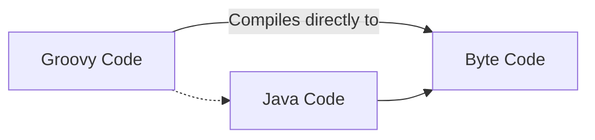

### Gradle + Groovy

# Gradle

### Introduction

- Build Automation Tool
- Managers dependencies and all stuff that mvn does but it's better than mvn
- Uses Groovy.
- Is fast and comes with many idempotent features.

.gitignore : .gradle

### Project Structure and Initialize a new Project


- `gradle init` to create a new project with a gradle wizard

> Remember: Always use gradle wrapper to run your tasks

- `./gradlew help` : manning

- `./gradlew dependencies` : To see all the dependencies

### Gradle and Java

Java Project Requirements

- .java -> .class files
- manage resources that live alongside code
- package everything into a jar file
- easily run tests
- define dependenices

All the above requirements can be satisfied by just adding a Java Plugin as shown below:

```groovy
plugins {
    // core gradle plugin
    id 'java'
}
jar {
    manifest {
        // creates a manifest file and tells what is the main class
        attributes('Main-Class' : 'com.tomgregory.languageapp.SayHello')
    }
}
```

- adds a task:compileJava `./gradlew compileJava`
- managing resources using task:processResources `./gradlew processResources`
- package into JAR file task:jar `./gradlew jar` found in directory _build > libs_
- task:test `./gradlew test`
- define dependencies in `build.gradle`

  ```groovy
  // Specifying the respository from where to download the dependenices
  repositories {
    mavenCentral()
  }

  dependencies {
    implementation  'org.apache.commons:commons-lang3:3.11'
    testImplementation 'org.junit.jupiter:junit-jupiter-api:5.6.0'
  }
  ```

# **Groovy**

- Built on top of Java to make the development process faster and easier with less boilerplate code
- Purely Object Oriented



- `groovyc` : compiles the groovy code to byte code

### **imports**

- you get the default imports by default they won't be visible
- importing a class :

  ```groovy
  import groovy.xml.MarkupBuilder
  import groovy.xml.*
  ```

### **Comments**

- Single-line comment `// This is a comment`

- Multi-line comment

  ```groovy
  /*
    Multi-line comment
  */
  ```

- groovy-doc comment :

  ```groovy
  /**
  * @Params:
  * @Return:
  * groovy-doc comment, used for generating documentation
  */
  ```

- shebang comment :

  ```groovy
  #!/usr/bin/env groovy
  println "Hello, World!"
  ```

### **Assertions**

- can be simply used with `assert` keyword
- examples :
  - `assert true`
  - `assert 1 == 1`
  - `assert 1 == (3+10)\100 * 5\20`

### **Scripts**

- groovy can be called as scripting langauge with the definiton outside the class body, but this is actually not true.
- when compiled the definiton is placed into a method run in class created by groovy

### **Classes**

- similar to Java Classess but on steroids

- same class name is not required as the file name

- you can define multiple classess in one file and at compile time you will have n separate \*.class files

- ### Creating a class

  ```groovy
  // By default all classes & methods are public, but you can use access modifiers to change the scope
  class User {
    String first
    String last

    def languages = []

    public void printName() {
        println "$first $last"
    }
  }

  ```

- ### Using a class

  ```groovy
  User u = new User()

  // Setting a property or data member
  d.first = "Dan"
  d.setFirst("Dan")

  d.printName()

  // adding objects to ArrayList
  d.languages << "Groovy"
  d.languages << "Java"

  ```

### **Numbers**

- Groovy uses only Objects wrapper for numbers, even if you wish you can't use the primitive data types here.

  - example :

    ```groovy
    int x = 10
    println x.class // op: class java.lang.Integer

    def y = 10.5d
    println y.class // op: class java.lang.Double

    def y = 10.5
    println y.class // op: class java.math.BigDecimal
    ```

- Groovy can identify on it's own what type of number is being used.

### **Loops**

- **for** x **in** y

  ```groovy
  def list = [1,2,3,4,5]
  for ( num in list ) {
      println num
  }
  ```

- **switch**

  ```groovy
  switch(x){
    case 1:
        // do something
        break
    case 2:
        // do something different
        break
    default:
        // do default
        break
  }

  ```

## **Annotations and AST Transformations**

```groovy

@Controller // Annotation
class x {

}

```

Documentation: [AST transformations](https://docs.groovy-lang.org/latest/html/gapi/groovy/transform/package-summary.html)

AST transformations helps us to perform bunch of funtionalites using just annotations.

Use annotations like immutable, Synchronization and more to quickly add some functionality to your classes.

example: `@toString`

Found in: `groovy.transform` package

```groovy
// Once set using the constructor args it can't be updated (set)
@Immutable
class Customer {
    String first, last
    int age
    Date since
    Collection favItems
}
```

---

### **operators**

- ### Ternary Operators

  ```groovy
  x = condition ? true : false
  ```

- ### Elvis Operators

  ```groovy
  // if condition use condition else default
  x = condition ? : "default"
  ```

- ### Object Operators

  ```groovy
    // if p.address == null this won't throw error.
    def address = p?.address
  ```

## Grape

- Jar dependency manager embeded into groovy
- Used with the help of annotations

  ```groovy
  @Grapes{
    // downloads this dependency from mvn
    @Grab(group='org.apache.commons', module='commons-lang3' , version='3.4')
  }
  ```

## **Data Types**

- Everything is a object in groovy
- `def` We don't care what datatype

```groovy
def x = 10
x = "Dan" // Yes, This will work!!!
// No assignment error

```

### **Converting Datatypes**

```groovy
// type casting
def myFloat = (float)1.0

// converting to a different fam
int a = '5'.toInteger()
``'
```

### **Times | Upto | Downto | Step**

- times

  ```groovy
  // prints - 20 times
  20.times{
    print '-'
  }

  ```

- upto

  ```groovy
    // prints 1 to 10
    1.upto(10){ num ->
      print num
    }

  ```

- upto

  ```groovy
    // prints 10 to 1 (reverse)
    10.downto(1){ num ->
      print num
    }

  ```

- step

  ```groovy
  // prints 0 to 1 with step 0.1
  0.step(1,0.1){ num ->
    print num
  }
  ```

### **Strings**

- String str = 'this is a string'
- By default considers `char` a `String`

#### **String Interpolation**

```groovy
def name = "World"
String msg = "Hello ${name}" // evaluated at runtime o/p: Hello World
String msg = 'Hello ${name}' // evaluated the actual expression o/p: Hello ${name}

```

#### **Multi-line quotes**

```groovy
def multiline = '''
This will
be printed as it
is loo-
-king right
noww!
'''
```
